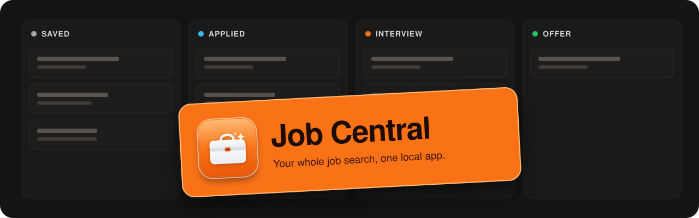

<p align="center"></p>

# Job Central

A local-first job search planner, CV studio, and portal tracker for the desktop (Electron + React + TypeScript). Your data stays on your machine.

## Features

- CV Studio: master CV editing, templates, accent colors, density and fonts, profile photo, section visibility, and PDF/Word export. The preview renders the real exported PDF.
- Per-job CV variants tailored from your master CV, with optional AI instructions.
- Cover letter generator (English and German) with editable saved letters.
- Job tracker with planner lanes, statuses, notes, timeline, follow-up dates, and sent-CV linkage.
- Job sourcing from configurable portals and public job boards (Greenhouse, Lever, Ashby, Personio, Recruitee, SmartRecruiters), plus an optional bring-your-own Adzuna key.
- Import an existing CV (PDF, DOCX, text) to prefill your profile.
- Multi-profile workspaces, English/German UI, optional folder mirror of your CVs and letters.
- Optional AI assistance for tailoring, job evaluation, follow-ups, and interview prep.

## Requirements

- Node.js 22 or newer
- macOS is the primary target
- AI features (optional) run through CLIs you have installed and signed in to: `claude` (Claude Code), `codex`, `opencode`, or `agy` (Antigravity). Job Central auto-detects them; nothing is sent anywhere unless you run an AI action.
- OCR of scanned PDFs (optional) uses Apple's Vision framework and needs macOS with a Swift toolchain (Xcode Command Line Tools). Without it, text-based PDFs still import normally.

## Quick start

```bash
git clone https://github.com/cukas/job-central.git
cd job-central
npm install
npm run dev
```

The renderer runs at `http://127.0.0.1:5173/` and Electron starts against it.

## Build

```bash
npm run typecheck   # type check renderer and main process
npm run build       # production build
npm run pack        # unpacked app in release/
npm run dist:mac    # DMG + zip for arm64 and x64 in release/
```

Without signing credentials, `dist:mac` produces unsigned artifacts (macOS will show a Gatekeeper warning on first open). To sign, install a Developer ID Application certificate in your keychain (or set `CSC_NAME`). To notarize, set either `APPLE_KEYCHAIN_PROFILE` (a `notarytool store-credentials` profile) or `APPLE_ID`, `APPLE_APP_PASSWORD`, and `APPLE_TEAM_ID`. Notarization is skipped when none are set.

## Privacy

All data is stored locally under the Electron user-data directory (`job-central-data/workspace.json`, exports in `job-central-data/exports/`). Network requests are limited to job boards you search and, if you enable it, the AI CLI you choose.

## License

MIT. See [LICENSE](LICENSE).
